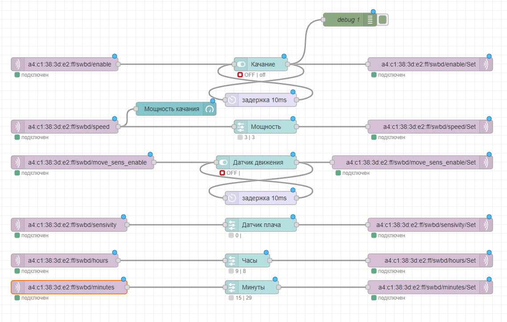
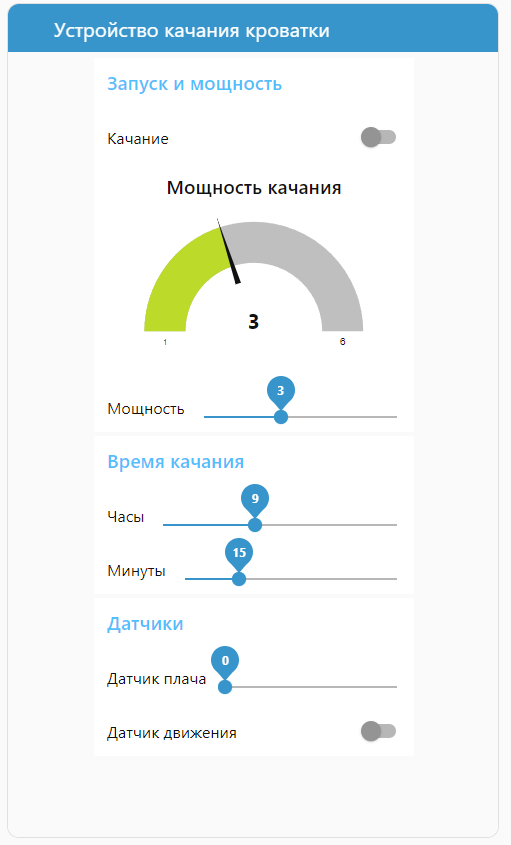

# SWBD-BLE2MQTT

Шлюз BLE2MQTT, работающий на ESP32, который позволяет подключить устройства для качания кроватки "Паинька", "Соня", "Тихоня" и "Совушка" к MQTT-брокеру и, следовательно, к любой системе умного дома - Алисе от Яндекса, Марусе от VK, к Home Assistant, openHub, Node-RED и прочим, поддерживающим работу с MQTT-протоколом.
В свою очередь, это дает возможность управлять устройством качания отовсюду, где есть Интернет; располагать на одном интерфейсе органы управления устройством качания и другими приборами в детской - камерой видеонаблюдения, шторами, освещением, мультимедиа-устройствами и пр.

Это форк  [вот этого проекта](https://github.com/shmuelzon/esp32-ble2mqtt).

## Как работает шлюз

1. Шлюз подключается к заданной сети Wi-Fi и к заданному MQTT-брокеру.
2. Шлюз сканирует находящиеся рядом с собой Bluetooth LE устройства и подключается к устройствам со следующими именами:
* `SWBDdrv_mc1` - "Паинька"
* `SWBDdrv_mc2` - "Соня"
* `SWBDdrv_mc3` - "Тихоня"
* `SWBDdrv_mc5` - "Совушка"
3. При изменении параметров устройства качания (запущено качание или нет, мощности качания, чувствительности датчика плача, состояния датчика движения (включен или нет), времени качания) шлюз передает MQTT-брокеру сообщения о состоянии устройства. 
4. При получении от MQTT-брокера сообщений, управляющих устройством качания, шлюз передает устройству качания соответствующую BLE-команду.

Таким образом, шлюз организует двустороннюю связь между устройством качания и MQTT-брокером. 

|Параметр|Топик управления|Топик состояния|Значения (строковый тип)|
|-|--------|---|--|
|Запущено ли качание|`<MAC>/swbd/enable`|`<MAC>/swbd/enable/Set`|`0`-не запущено, `1` - запущено|
|Мощность качания|`<MAC>/swbd/speed`|`<MAC>/swbd/speed/Set`|`1`..`6`|
|Чувствительнось датчика плача|`<MAC>/swbd/sensivity`|`<MAC>/swbd/sensivity/Set`|`0`..`5`, если `0`, то  датчик отключен|
|Включен ли датчик движения|`<MAC>/swbd/move_sens_enable`|`<MAC>/swbd/move_sens_enable/Set`|`0`- отключен, `1` - включен|
|Время качания (часы)|`<MAC>/swbd/hours`|`<MAC>/swbd/hours/Set`|`0`..`23`|
|Время качания (минуты)|`<MAC>/swbd/minutes`|`<MAC>/swbd/minues/Set`|`0`..`59`|

В приведенной таблице `<MAC>` - это MAC-адрес устройства качания. Например, чтобы запустить качание устройства с MAC-адресом `a4:c1:38:da:fd:00`, нужно записать в топик `a4:c1:38:da:fd:00/swbd/enable/Set` строковое значение `1`. Если всё произошло удачно и устройство запустилось, то шлюз запишет в топик `a4:c1:38:da:fd:00/swbd/enable` значение `1` (а также в другие топики - соответствующие параметры устройства качания).

## Как настроить готовый шлюз

Купить готовый прошитый шлюз можно [здесь]().

При включении шлюз создаст точку доступа с именем `BLE2MQTT-XXX`. Нужно подключиться к этой точке доступа и ввести в адресную строку браузера IP-адрес шлюза `192.168.4.1`. Используя возможности веб-интерфейса, отредактировать [конфигурационный файл](#configuration): ввести название Wi-Fi сети, пароль к сети, адрес MQTT-брокера, порт MQTT-брокера и, если требуется, имя и пароль для подключения к брокеру. На этом настройка шлюза завершена, после презагрузки шлюз будет готов к работе.

Если файл конфигурации окажется синтаксически неверным, точка доступа появится при перезагрузке снова. 

Если точка доступа при перезагрузке не появилась, но есть необходимость отредактировать файл конфигурации, можно открыть веб-интерфейс шлюза по IP-адресу, который можно узнать, например, с помощью веб-интерфейса роутера. Если же шлюз не подключился к роутеру (имя сети или пароль указаны неверно), то можно перевключить шлюз с зажатой кнопкой - и точка доступа снова появится.

### Как узнать MAC-адрес устройства качания

Можно воспользоваться одним из способов: 
* С помощью любого MQTT-клиента, например, [MQTTX](https://mqttx.app), можно подключиться к MQTT-брокеру, подписаться на все его сообщения и посмотреть, какие сообщения приходят от устройства качания. Первая часть сообщения и есть MAC-адрес. Здесь же можно попробовать отправить сообщения устройству качания, и убедиться, что всё работает.
* На веб-интерфейсе шлюза отображаются все подключенные к шлюзу устройства качания и их MAC-адреса.

### Как подключить устройство качания к Алисе или Марусе

Самый простой вариант - воспользоваться сервисом https://www.wqtt.ru. Это облачный MQTT-брокер c готовыми навыками Алисы и Маруси.

### Как подключить устройство качания к Home Assistant

Нужно настроить MQTT-интеграцию и в настройки MQTT добавить, например, следующее:

```yaml
- switch:
      unique_id: swbd_enable
      name: "Качание"
      state_topic: "a4:c1:38:3d:e2:ff/swbd/enable"
      command_topic: "a4:c1:38:3d:e2:ff/swbd/enable/Set"
      payload_on: "1"
      payload_off: "0"
      state_on: "1"
      state_off: "0"
      optimistic: false
      qos: 0
      retain: true
```
Это запись создаст выключатель, который будет включать или отключать качание.

### Как подключить устройство качания к Node-RED

Пример: импортируем [файл](Node-RED/flows.json), меняем параметры подключения к MQTT-брокеру и МАС-адрес устройства качания. 



В результате получаем вот такую панель управления:



Буду признателен, если кто-нибудь пришлет пример получше.

## Как самостоятельно изготовить шлюз

Понадобится плата с модулем ESP32-WROOVER или ESP32-WROOM, таже подойдут платы на ESP32-C3 или ESP32-S3.

### Компиляция

1. Установка `ESP-IDF`

Устанавливаем
[Espressif IoT Development Framework](https://github.com/espressif/esp-idf)
по инструкции [Installation Instructions](https://docs.espressif.com/projects/esp-idf/en/latest/esp32/get-started/linux-macos-setup.html),
там всё написано. Обязательно выполняем все шаги, включая шаг 4. 

2. Загружаем репозиторий:

```bash
git clone --recursive https://github.com/Karpesh/swbd-ble2mqtt
```

3. Модифицируем config.json и прошиваем плату

Модифицируем [файл конфигурации](#configuration) - как минимум нужно прописать имя сети, пароль сети и параметры MQTT - адрес, порт, имя пользователя и пароль. Компилируем и прошиваем плату:

```bash
idf.py build flash
```

4. Припаиваем кнопку к контактам GND и GPIO_NUM_13 (определена в файле [swbd.h](https://github.com/Karpesh/swbd-ble2mqtt/blob/737671ae9121cf41cecb8a3ef5f62494e72d5909/main/swbd.h#L9), при включении с зажатой кнопкой появляется точка доступа).


### Конфигурирование

Конфигурационный файл находится здесь:
[data/config.json](data/config.json). Он содержит все опции конфигурации.
Для работы шлюза нужно изменить значения только в секциях `network` и `mqtt`. 

* В секции `wifi` задаем имя сети (вместо `MY_SSID`) и пароль (вместо `MY_PASSWORD`): 
```json
{
  "network": {
    "wifi": {
      "ssid": "MY_SSID",
      "password": "MY_PASSWORD",
      "eap": {
        "method": null,
        "identity": null,
        "client_cert": null,
        "client_key": null,
        "server_cert": null,
        "username": null,
        "password": null
      }
    }
  }
}
```

* В секции `mqtt` задаем адрес MQTT-брокера (вместо `192.168.1.1`) и порт (вместо `1883`). Также, если необходимо, нужно указать имя пользователя и пароль.
```json
{
  "mqtt": {
    "server": {
      "host": "192.168.1.1",
      "port": 1883,
      "ssl": false,
      "client_cert": null,
      "client_key": null,
      "server_cert": null,
      "username": null,
      "password": null,
      "client_id": null
    },
    "publish": {
      "qos": 0,
      "retain": true
    }
  }
}
```

* Остальное не меняем. Более подробно о настройках конфигурационного файла можно прочитать в описании [оригинального проекта](https://github.com/shmuelzon/esp32-ble2mqtt).

### Если происходит что-то непонятное и ничего не работает

Нужно посмотреть лог. Лог выводится в UART платы, но гораздо удобнее воспользоваться удаленным логгированием.

Для этого в конфигурационном файле должна быть секция:

```json
{
  "log": {
    "host": "224.0.0.200",
    "port": 5000
  }
}
```

Если эта секция есть, приложение отправляет логи по UDP другому хосту, что позволяет смотреть логи удаленно без подключения по UART. Чтобы получать логи на вашем хосте, запустите `idf.py remote-monitor`.